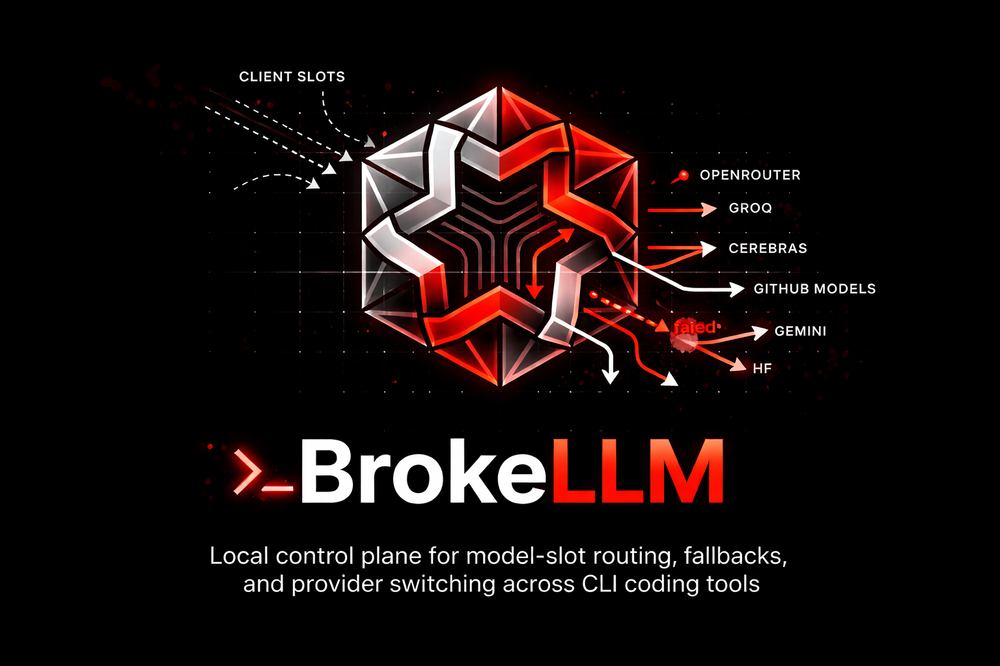
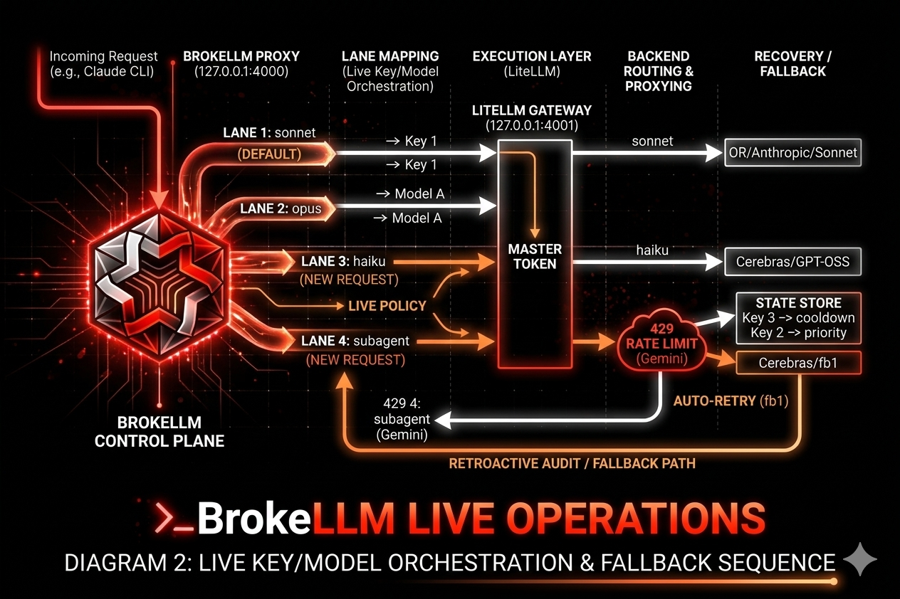
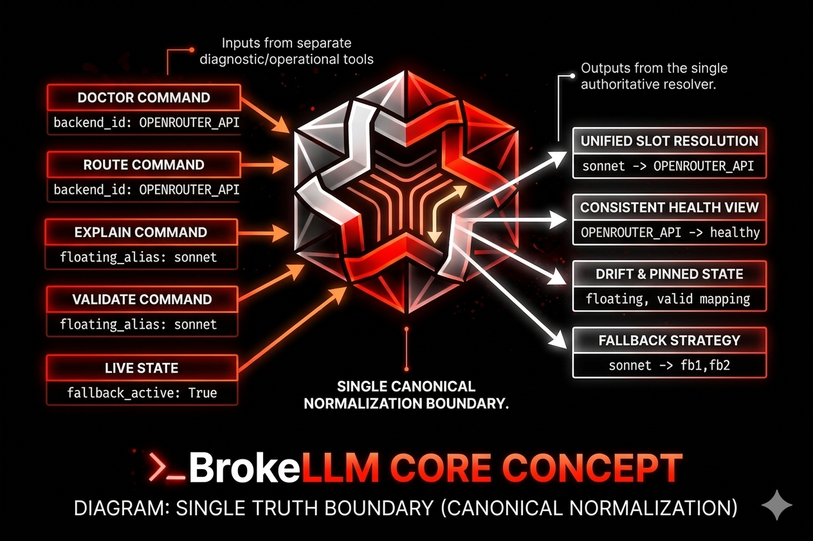
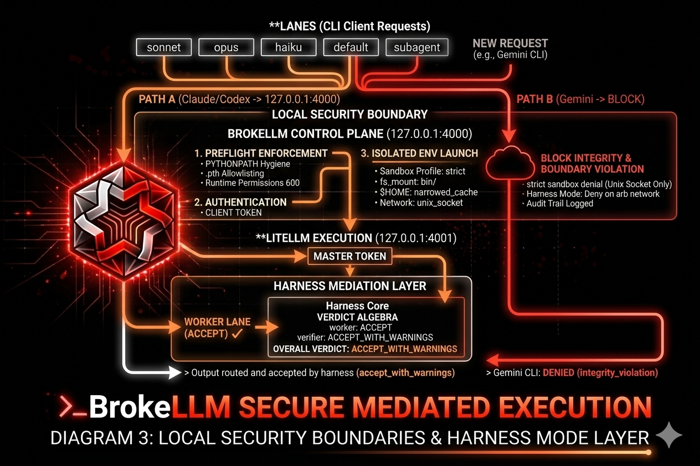
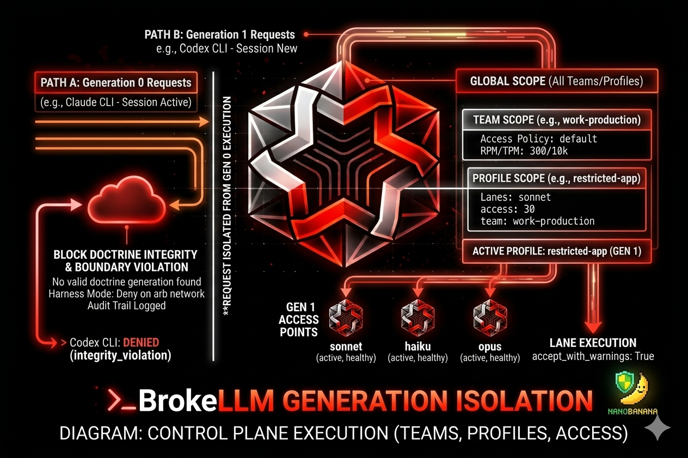
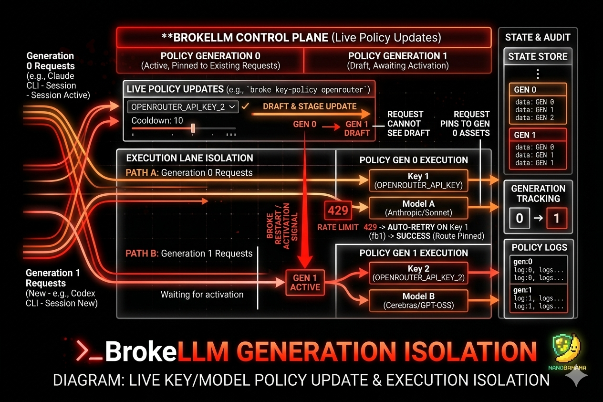
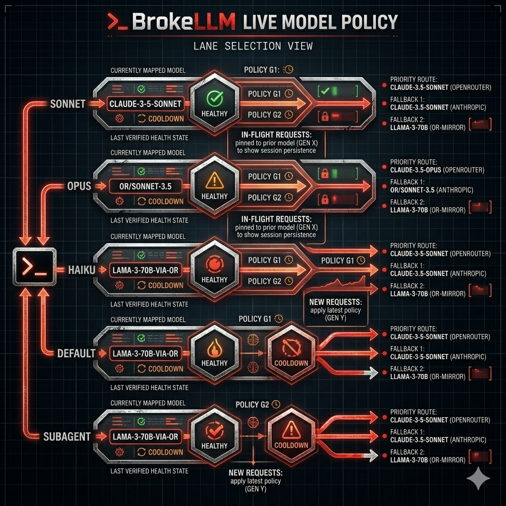
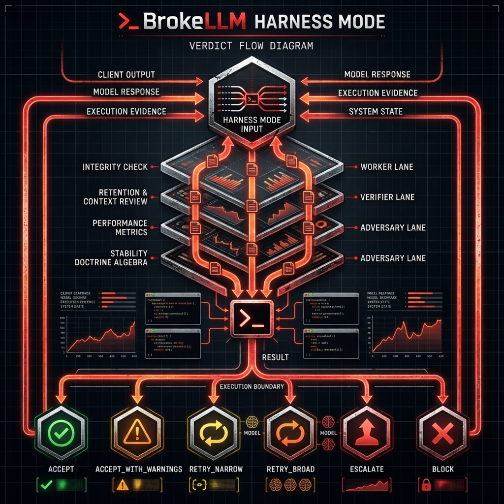
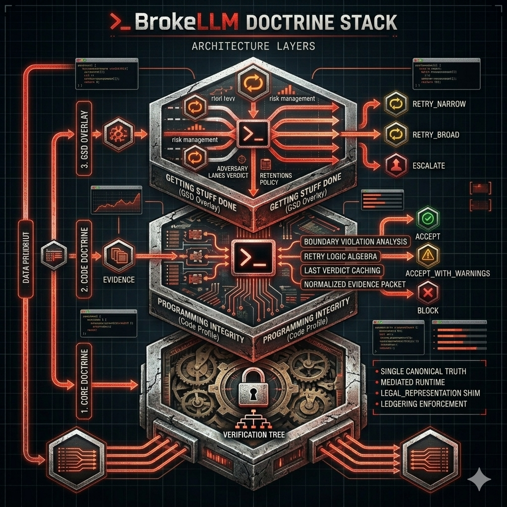

# BrokeLLM

**Local control plane for model-slot routing, fallbacks, and provider switching across CLI coding tools.**  
*Keep your client speaking in slots. Control what actually answers.*



[](LICENSE)
[](https://www.python.org/)
[](https://github.com/BerriAI/litellm)
[]()

---

## The Problem

Most CLI coding tools assume stable access to expensive frontier models.

| Situation | The Failure Mode |
| --- | --- |
| **Single provider** | One outage, one price hike — your workflow stops |
| **Hand-editing configs** | Every backend swap requires touching LiteLLM config manually |
| **No fallback logic** | A dead route has no graceful alternative |
| **No routing visibility** | You don't know what's actually answering your slots |
| **Locked-in clients** | `claude`, `codex` assume *you* speak their model names |

> *"Most routing tools treat the client as the problem. BrokeLLM treats the routing layer as the solution."*

---

## The Solution

BrokeLLM puts a **local control plane** in front of multiple providers. Clients keep speaking in stable lanes — Claude-style (`sonnet`, `opus`, `haiku`, `custom`, `subagent`), Codex-style (`gpt54`, `gpt54mini`, `gpt53codex`, `gpt52codex`, `gpt52`, `gpt51codexmax`, `gpt51codexmini`) — while you control which provider and model actually answers.



**One stable local interface. Backends become swappable.**

---

## System Structure

BrokeLLM is a **governed execution system**, not just a proxy, router, or harness in isolation.

Its runtime is composed of multiple cooperating layers:

1. **Execution**: runs requests and tool-facing flows against the selected model/provider path
2. **Enforcement**: applies boundary checks, policy rules, and runtime constraints
3. **Adjudication**: separates worker, verifier, and adversary review paths
4. **Verdict System**: resolves outcomes through formal verdict algebra
5. **Evidence Binding**: anchors decisions to logs, artifacts, state, and execution traces
6. **Orchestration**: controls retries, escalation, lifecycle flow, and route transitions

The diagrams below are views into those layers. No single diagram is the whole system.

BrokeLLM is not merely:

- a proxy
- a router
- a simple harness
- a wrapper around model calls

Those are mechanisms inside the runtime, not the runtime's full identity.

---

## Quickstart

```bash
git clone https://github.com/B-A-M-N/BrokeLLM.git
cd BrokeLLM
./install.sh
cp .env.template .env
broke doctor
broke list
```

> New to AI-assisted tools? See [`HUMAN_ONLY/FOR_BEGINNERS.md`](HUMAN_ONLY/FOR_BEGINNERS.md) for a beginner-facing guide.

---

## Client Support

| Client | Status | Notes |
| --- | --- | --- |
| **Claude CLI** | ✅ Verified | Works against the local LiteLLM gateway |
| **Codex CLI** | ✅ Verified | Custom provider config via Responses API wire format |
| **Gemini CLI** | ⚠️ Experimental | Raw endpoint works; CLI path not yet reliable |

---

## Core Concepts

BrokeLLM is built around three ideas:



The point: **clients keep speaking in slots. You control what actually answers.**

---

## Capabilities

### 🔀 Routing Control

- Claude-style lanes: `sonnet`, `opus`, `haiku`, `custom`, `subagent`
- Codex-style lanes: `gpt54`, `gpt54mini`, `gpt53codex`, `gpt52codex`, `gpt52`, `gpt51codexmax`, `gpt51codexmini`
- Interactive route switching with `broke swap`
- Team and profile presets for reusable configurations
- Fallback chain support per slot

### 🔍 Observability & Validation

- Drift warnings for floating aliases
- Health, validation, explain, route, metrics, and probe commands
- Focused regression tests for control-plane behavior
- Single canonical truth boundary — no split-brain state

### ⚡ Execution

- BrokeLLM runtime proxy on `http://localhost:4000`
- LiteLLM execution layer behind the proxy on an internal port
- Unified local entrypoint for `claude` and `codex`
- Simple one-command install

### 🔑 Live Key Orchestration

- Multi-key pools per provider using `*_API_KEY`, `*_API_KEY_2`, `*_API_KEY_3`
- Live key rotation policy for new requests without restarting the client session
- Per-key health state: `healthy`, `cooldown`, `blocked`, `auth_failed`
- Atomic policy/state writes with generation tracking
- Reason-coded rotation logs for `429`, `401/403`, timeout, and manual disable
- Applies to both Claude and Codex, because both route through the same BrokeLLM proxy on `:4000`

### 🧠 Live Model Orchestration

- Per-lane live model policy across Claude, Codex, and semantic lane families
- New requests can switch models without restarting the client session
- Per-model health state: `healthy`, `cooldown`, `blocked`, `incompatible`
- Model policy changes are generation-tracked and applied only to new requests
- In-flight requests stay on the model/key they already started with

### 🧷 Harness Mode

- Harness mode is separate from `BROKE_MODE=cli|router`
- Supported profiles: `off`, `throughput`, `balanced`, `high_assurance`
- Verdict algebra: `ACCEPT`, `ACCEPT_WITH_WARNINGS`, `RETRY_NARROW`, `RETRY_BROAD`, `ESCALATE`, `BLOCK`
- Blocks integrity and boundary violations
- Retries weak or incomplete work
- Warns on mediocre but still operational work
- Persists last verdict and categories for later inspection
- Caches stable role doctrine, normalized evidence packets, and repeat-review verdicts to reduce prompt drift and no-op re-review churn
- `broke harness run` turns BrokeLLM into the launch boundary for a mediated CLI-agent run with per-run ledgering and shimmed command observation

### 🔌 ACP Facade

- `broke acp-server` exposes a Broke-owned ACP-compatible stdio control surface for harness mode by default
- Gemini can sit behind native ACP-style transport semantics
- Claude runs as a persistent `stream-json` CLI session normalized behind the Broke ACP facade
- Codex runs as a persistent `app-server` JSON-RPC session normalized behind the Broke ACP facade
- OpenRouter, Groq, Cerebras, and local models run as headless logical ACP lanes with persistent Broke-owned session state and ephemeral provider calls
- Session truth, cancellation, and lane-result schema stay Broke-owned even when provider runtimes differ

### 🔒 Local Security



- BrokeLLM proxy binds to `127.0.0.1:4000`
- LiteLLM binds to `127.0.0.1:4001`
- Launch preflight enforces the pinned LiteLLM version, lockfile drift checks, `.pth` allowlisting, `PYTHONPATH` hygiene, `600` runtime file permissions, and harness shim integrity before BrokeLLM starts or launches a client
- Client requests require a local BrokeLLM token, except local health endpoints
- Proxy-to-LiteLLM traffic uses a separate internal master token
- Runtime policy/state/token files are written with restricted local permissions and shared file locking
- Claude, Codex, and Gemini launch through a sanitized client env to reduce stale auth/base-url leakage
- Provider secrets are injected only into the specific child processes that need them; BrokeLLM no longer globally exports `.env`
- Launched client sessions write an audit trail to `.launch_audit.log` showing the injected env surface and secret counts, never secret values or secret variable names
- The proxy fails closed on unknown routed model ids with `400 invalid_model`
- The proxy rate-limits repeated invalid auth attempts from the same client address

### 📦 Locked Supply Chain

- Top-level dependency input is pinned exactly in `requirements.txt`
- Full transitive lock lives in `requirements.lock`
- Installs use `pip --require-hashes`
- Optional local wheel mirror lives in `vendor/wheels`
- `make lock` refreshes the hash-verified lock file
- `make mirror-wheels` refreshes the local wheel mirror

### 🧱 Sandbox Profiles

- `normal` keeps compatibility highest while still using targeted child-process env injection
- `hardened` adds the same isolated env launch with stricter process umask
- `strict` runs launched clients under `bwrap` with an explicit filesystem/environment boundary and no arbitrary outbound network
- In `strict`, Claude and Codex get a local-only bridge back to the BrokeLLM proxy over a Unix socket; Gemini is blocked because it still needs direct network access
- Strict-mode home binds are narrowed to client-specific state directories instead of broad `$HOME/.config` / `$HOME/.cache` exposure, and the sandbox only mounts BrokeLLM's `bin/` helpers rather than the full BrokeLLM repo
- Sandbox profiles apply to launched clients, not the internal BrokeLLM proxy itself

---

## Supported Providers

| Provider | Notes |
| --- | --- |
| **OpenRouter** | Recommended; includes free-tier models |
| **Groq** | Fast inference |
| **Cerebras** | High-throughput option |
| **GitHub Models** | GPT-4o-mini and others |
| **Gemini** | Direct endpoint verified; CLI path experimental |
| **Hugging Face** | Free-tier access |

> LiteLLM itself supports far more providers. BrokeLLM is an intentionally smaller, opinionated layer on top.

---

## Design Principle: One Truth Boundary

All health, drift, and routing state is resolved through a **single canonical normalization boundary** in the control plane.

`doctor`, `route`, `explain`, and `validate` do not maintain separate views of backend identity. They consume the same shared resolver — so the tool always reports one consistent truth about:

- which backend a slot maps to
- whether that backend is healthy
- whether the route is pinned or floating
- whether fallback state is relevant

> *If those surfaces disagree, the control plane stops being trustworthy. That design rule matters more than any single command.*

See [`ARCHITECTURE.md`](ARCHITECTURE.md) for the full truth-boundary specification.

---

## Commands

### Gateway

```bash
broke            # start the full wrapper
broke start      # start only the gateway
broke stop
broke restart
broke status
```

### Routing

```bash
broke list
broke models
broke swap
broke swap <team>
broke fallback <slot>               # interactive backend picker
broke fallback <slot> <fb1> [fb2...]
broke fallback policy
```

### Teams



```bash
broke team save <name> [cli|route]
broke team load <name>
broke team list
broke team delete <name>
broke team fallback <team> <slot> <fb1> [fb2...]
broke team access <team> [--slots sonnet,gpt54] [--rpm N] [--tpm N]
```

> `0` means unlimited for `rpm` and `tpm`. Omitted values mean "leave unchanged."

### Profiles

```bash
broke profile new <name> <team> [--desc "text"] [--slots sonnet,gpt54] [--rpm N] [--tpm N]
broke profile load <name>
broke profile list
broke profile delete <name>
```

### Observability

```bash
broke doctor
broke validate
broke explain <slot>
broke route <slot>
broke metrics
broke probe <slot>
broke key-policy
broke key-state
broke model-policy
broke model-state
broke sandbox
broke harness
```

### Live Key Policy



```bash
broke key-policy
broke key-policy openrouter --mode round_robin --cooldown 45 --retries 2 --order OPENROUTER_API_KEY_2,OPENROUTER_API_KEY
broke key-state
broke key-state set OPENROUTER_API_KEY_2 blocked
```

Policy changes apply to new requests without forcing you to exit the current client session. In-flight requests keep using the key they already started with.

### Live Model Policy



```bash
broke model-policy
broke model-policy gpt54 --mode priority_order --cooldown 60 --retries 2 --order OR/Qwen-3.6+,Groq/Kimi-K2
broke model-state
broke model-state set "Cerebras/GPT-OSS-120B" cooldown
```

Model policy changes apply to new requests without forcing you to exit the current client session. In-flight requests keep using the model they already started with.

### Sandbox Profiles

```bash
broke sandbox
broke sandbox set hardened
broke sandbox set strict
```

`strict` is intentionally optional. It is more isolated, but it can break clients that expect broader filesystem or session access.

Network policy by profile:

- `normal` → unrestricted
- `hardened` → unrestricted
- `strict` → local-only for Claude/Codex, denied for Gemini

### Harness Mode



```bash
broke harness
broke harness checklist
broke harness run --policy balanced -- --help
broke harness set throughput
broke harness set balanced
broke harness set high_assurance
broke harness evaluate --worker ACCEPT --verifier RETRY_BROAD --adversary ACCEPT_WITH_WARNINGS --risk normal --retries 0
broke harness evaluate --task "fix fallback routing" --diff "bin/_mapping.py changed" --tests "python3 -m unittest"
```

Harness mode is orthogonal to `cli` vs `router` mode. It does not replace routing. It adds a runtime decision layer on top of deterministic checks and optional worker/verifier/adversary verdict inputs.

The harness now persists review-lane control-plane state, not just final verdict summaries:

- durable `worker` / `verifier` / `adversary` lane records
- logical lane session ids independent of backend runtime lifetime
- typed evidence artifacts for task, diff, tests, commands, policy events, and retry history
- explicit observation vs inference separation in evidence packets
- durable per-lane verdict contributions
- degraded review-lane policy as part of verdict algebra

Use `broke harness checklist` to inspect the current implementation checklist from the CLI, or open `broke dashboard` to inspect lane health, checklist progress, and last lane contributions visually.

`broke harness run` is the first mediated-runtime slice. It registers a `run_id`, builds a per-run env plan, prepends harness shims for key tools, writes an append-only event ledger under `.runtime/harness/<run_id>/events.jsonl`, and opens a completion checkpoint when the launched client exits.

Spec docs:



- [Harness Core](./docs/harness/CORE.md)
- [Harness Code Profile](./docs/harness/CODE.md)
- [Harness GSD Overlay](./docs/harness/GSD.md)
- [Harness Lane Checklist](./docs/harness/LANE-CHECKLIST.md)
- [Harness ACP Lane Spec](./docs/harness/ACP-LANE-SPEC.md)
- [Harness ACP Hardening](./docs/harness/ACP-HARDENING.md)

Worker lane options:

- default: `broke_router` with `broke_managed` credentials
- elevated option: `provider_direct` with `provider_managed` credentials for the worker lane
- Gemini surface-direct option: `client_direct` with `provider_managed` credentials for harnessing Gemini CLI around BrokeLLM rather than through it

Example:

```bash
broke harness run --worker-route provider_direct --elevated --provider claude -- --help
broke harness run --worker-route client_direct --provider gemini -- --help
```

Provider-direct worker runs are explicit on purpose. They are treated as authority expansion and are denied unless `--elevated` is present.

### Snapshots

```bash
broke snapshot save
broke snapshot list
broke snapshot restore <id>
```

### Safety Controls

```bash
broke freeze        # toggle freeze
broke freeze on     # block swap-style state changes
broke freeze off
```

### Provider Selection

```bash
broke provider
broke provider list
broke provider swap [claude|codex|gemini]
```

---

## Example: Diagnosing a Broken Route

```bash
broke doctor
broke explain gpt54
broke route gpt54
```

Use these together to isolate different failure classes:

| Command | What It Tells You |
| --- | --- |
| `broke doctor` | Whether the gateway and upstream backends are healthy |
| `broke explain gpt54` | Configured slot, backend, health view, and fallback chain |
| `broke route gpt54` | What would actually be selected for that slot right now |

This separates: provider failure / bad mapping state / access-policy blocking / fallback activation risk.

---

## Example: Routing Across Providers

Route `gpt54` through one provider lane, `haiku` through another, inspect, save:

```bash
broke list
broke explain gpt54
broke route gpt54
broke team save work
```

Create a restricted profile for a production app:

```bash
broke profile new myapp work --desc "Production app" --slots gpt54 --rpm 30
broke connect --profile myapp
```

Programmatic clients can select a profile explicitly with `X-Broke-Profile: myapp` when using the global gateway token. Profile-bound tokens created with `broke connect --profile ...` are pinned to that profile and reject mismatched `X-Broke-Profile` overrides.

---

## Compatibility Notes

**Codex** — verified on April 3, 2026 using a custom provider configuration over the Responses API wire format:

```bash
env BROKE_DUMMY=dummy \
  codex exec \
  -c 'model_provider="broke"' \
  -c 'model_providers.broke={name="BrokeLLM",base_url="http://localhost:4000/v1",env_key="BROKE_DUMMY",wire_api="responses"}' \
  -m 'GitHub/GPT-4o-mini' --skip-git-repo-check --json \
  "Respond with exactly OK and nothing else."
```

> The previous `OPENAI_BASE_URL` env override approach was not reliable for Codex and is no longer the recommended path.

**Gemini** — BrokeLLM's Google-compatible HTTP endpoint works. The Gemini CLI itself is not reliable through BrokeLLM: even with `GOOGLE_GEMINI_BASE_URL` and `GEMINI_API_KEY_AUTH_MECHANISM` set, the CLI internally routes to `Gemini/2.0-Flash` which BrokeLLM does not expose. Until that changes upstream, Gemini CLI compatibility should not be claimed.

---

## Verification

```bash
make verify
```

Current regression coverage:

- Launch preflight integrity enforcement
- Health agreement across `doctor`, `route`, and `explain`
- Pinned-state persistence during swap
- Floating alias drift warnings
- Zero-value limit semantics
- Installer interpreter consistency
- Env-name consistency
- Multi-key deployment generation across providers
- Live key-policy generation updates
- Live key-state persistence and cooldown behavior
- Live model-policy generation updates
- Live model-state persistence and cooldown behavior
- Local proxy auth and internal upstream auth enforcement
- Strict sandbox local-only bridge and launch audit hooks

---

## Installation

### Requirements

- Python 3.8+
- `curl`
- `lsof`
- One or more provider API keys
- `claude` or `codex` CLI installed

### Install

```bash
./install.sh
```

The installer will:

- Verify Python
- Install locked LiteLLM dependencies from `requirements.lock`
- Link `broke` into your `PATH`
- Create `.env` from `.env.template` if needed
- Initialize the default routing files

Optional supply-chain modes:

```bash
./install.sh --mirror-wheels
./install.sh --use-wheel-mirror
./install.sh --offline
```

- `--mirror-wheels` downloads the exact locked artifacts into `vendor/wheels`
- `--use-wheel-mirror` prefers the local wheel mirror during install
- `--offline` installs only from `vendor/wheels`

### Configuration

```bash
cp .env.template .env
```

Fill in whichever keys you plan to use:

```env
OPENROUTER_API_KEY=
OPENROUTER_API_KEY_2=
GROQ_API_KEY=
GROQ_API_KEY_2=
CEREBRAS_API_KEY=
CEREBRAS_API_KEY_2=
GITHUB_TOKEN=
GITHUB_TOKEN_2=
GEMINI_API_KEY=
GEMINI_API_KEY_2=
HF_TOKEN=
HF_TOKEN_2=
```

You do not need every key — only the providers you actively route to need valid credentials.

Optional security overrides:

```env
BROKE_CLIENT_TOKEN=
BROKE_INTERNAL_MASTER_KEY=
```

If you leave those unset, BrokeLLM generates local tokens automatically and stores them in restricted local files.

Dependency integrity files:

- [requirements.txt](/home/bamn/BrokeLLM/requirements.txt)
- [requirements.lock](/home/bamn/BrokeLLM/requirements.lock)
- [vendor/wheels](/home/bamn/BrokeLLM/vendor/wheels)

---

## Stability Notes

Free-tier models and routes can change availability, latency, quota behavior, or backing model behavior without notice.

For a more stable setup:

- Prefer pinned model entries over floating aliases
- Define fallback chains for important slots
- Save known-good mappings as teams
- Run `broke validate` and `broke doctor` before relying on a route

---

## When To Use BrokeLLM

| Situation | Good Fit? |
| --- | --- |
| You want cheaper or mixed-provider routing behind a stable local interface | ✅ |
| You need deterministic slot routing for CLI AI tools | ✅ |
| You care about health, drift, and explainability — not blind proxying | ✅ |
| You want to preserve the client-facing slot experience while changing backends freely | ✅ |
| You only use one provider and don't care about routing behavior | ❌ |
| You want fully managed SaaS simplicity instead of a local control plane | ❌ |
| You don't need observability, fallback chains, or slot abstraction | ❌ |

---

## Why I Built This

Most CLI coding tools assume you have stable access to expensive frontier models.

I did not.

BrokeLLM exists because I needed a way to keep using those tools without being locked into a single provider or cost structure. The goal was not to emulate a provider. The goal was to create a **local control plane** that lets the client experience stay the same while the backend becomes flexible, cheaper, and under user control.

I am a single father and primary caregiver to a young child with autism, and I am currently unemployed. This project is for anyone else in a similar situation who still wants to write code, experiment, and keep moving.

---

## Architecture

Control-plane behavior lives in [`bin/_mapping.py`](bin/_mapping.py).  
CLI entrypoint is [`bin/broke`](bin/broke).  
Truth-boundary specification is in [`ARCHITECTURE.md`](ARCHITECTURE.md).

---

## Contributing

Issues and improvements are welcome, especially around:

- **Harness runtime contracts** — tighten ACP lane behavior, PTY supervision, and adapter truth boundaries
- **Execution hardening** — improve shim integrity, sandboxing, and hostile-runtime resistance
- **Operator visibility** — better dashboard views, lane health, and run-channel observability
- **Cross-provider mediation** — Claude, Codex, and Gemini behavior parity behind the Broke harness facade
- **Documentation** — harness architecture, ACP semantics, and operator workflows

---

## Project Status

**Current milestone:** harness-oriented execution boundary and ACP/runtime mediation.

Suggested next steps:
- stabilize the harness runtime contract across Claude, Codex, and Gemini
- harden PTY supervision, lane health, and ACP adapter behavior
- keep documentation aligned with the harness-first development direction

---

## License

MIT — see [LICENSE](LICENSE).

LiteLLM is a separate upstream project with its own licensing and enterprise/commercial components. Review upstream terms independently if you distribute or extend those parts.

---

## Disclaimer

BrokeLLM is a personal open-source tool. It is not affiliated with Anthropic, OpenAI, Google, GitHub, Groq, Cerebras, Hugging Face, or BerriAI.

You are responsible for your API usage and billing, your provider terms, your local environment security, and pinning and reviewing dependency versions appropriately.

---

*Keep your client speaking in slots. Control what actually answers.* ⚡
